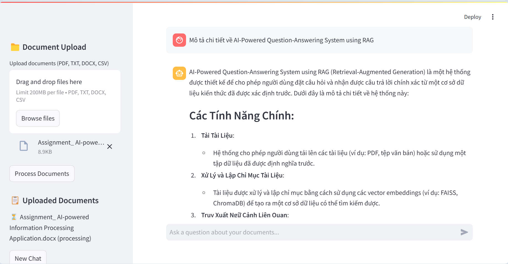
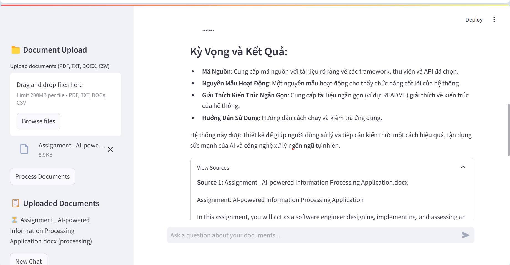

# Document Q&A System

This project is a **Document Q&A System** that allows users to upload documents and ask questions about their content. The system uses a combination of **FastAPI** for the backend and **Streamlit** for the frontend. It leverages **OpenAI's language models** and **FAISS** for vector storage to provide accurate and relevant answers to user queries.


## Project Structure

```bash
.
├── __pycache__/
├── .env
├── app.py
├── chat_history/
├── chat_manager.py
├── docker-compose.yml
├── Dockerfile
├── document_processor.py
├── main.py
├── requirements.txt
├── temp_vector_store/
├── uploads/
│   └── Assignment_ AI-powered Information Processing Application.docx
├── vector_store/
│   ├── index.faiss
│   └── index.pkl
└── vector_store.py
```

## How to Run with Docker

To run this project using Docker, follow these steps:

### 1. Clone the repository:
```bash
git clone <repository-url>
cd <repository-directory>
```

### 2. Create a `.env` file:
Create a `.env` file in the root directory of the project with the following content:
```bash
OPENAI_API_KEY=your_openai_api_key
```

### 3. Build the Docker image:
```bash
docker-compose build
```

### 4. Run the Docker containers:
```bash
docker-compose up
```

This will start both the **FastAPI backend** and the **Streamlit frontend**.
- The backend will be available at **http://localhost:8000**
- The frontend will be available at **http://localhost:8501**

## Project Components

### Backend (FastAPI)
The backend is implemented using **FastAPI** and provides the following functionalities:
- **Upload Documents**: Allows users to upload documents in **PDF, TXT, DOCX, and CSV** formats.
- **Process Documents**: Processes the uploaded documents and stores them in a **FAISS vector store**.
- **Query Documents**: Allows users to query the documents and get answers based on the content of the uploaded documents.

### Frontend (Streamlit)
The frontend is implemented using **Streamlit** and provides a user-friendly interface for interacting with the system:
- **Document Upload**: Users can upload documents through the sidebar.
- **Chat Interface**: Users can ask questions about the uploaded documents and receive answers in a chat-like interface.

## Key Files
- **`app.py`**: Contains the Streamlit application code.
- **`main.py`**: Contains the FastAPI application code.
- **`document_processor.py`**: Contains utilities for processing documents.
- **`vector_store.py`**: Contains utilities for managing the FAISS vector store.
- **`chat_manager.py`**: Contains utilities for managing chat history and integrating with the language model.

## Dependencies
The project dependencies are listed in the `requirements.txt` file. Some key dependencies include:
- `fastapi`
- `uvicorn`
- `streamlit`
- `openai`
- `faiss-cpu`
- `langchain`
- `requests`

## Running Locally
If you prefer to run the project locally without Docker, follow these steps:

### 1. Install dependencies:
```bash
pip install -r requirements.txt
```

### 2. Run the FastAPI backend:
```bash
uvicorn main:app --host 0.0.0.0 --port 8000 --reload
```

### 3. Run the Streamlit frontend:
```bash
streamlit run app.py
```

## Running the Code

### Steps to Use the Document Q&A System:

1. **Upload Documents**  
   - Open the frontend at **[http://localhost:8501](http://localhost:8501)** (or run `streamlit run app.py` if running locally).  
   - Use the **Upload Documents** section to upload one or multiple documents in **PDF, TXT, DOCX, or CSV** formats.  

2. **Process Documents**  
   - After uploading, **click the "Process" button** to process the documents.  
   - This step is necessary because multiple documents can be uploaded at once, and automatic processing might not always be ideal.  

3. **Ask Questions**  
   - Once processing is complete, use the chat interface to ask questions about the uploaded documents.  
   - The system will retrieve relevant information from the processed documents and provide accurate answers.  


## Conclusion
This **Document Q&A System** provides a powerful and flexible way to interact with document content using natural language queries. By leveraging modern NLP techniques and efficient vector storage, it offers accurate and relevant answers to user questions.